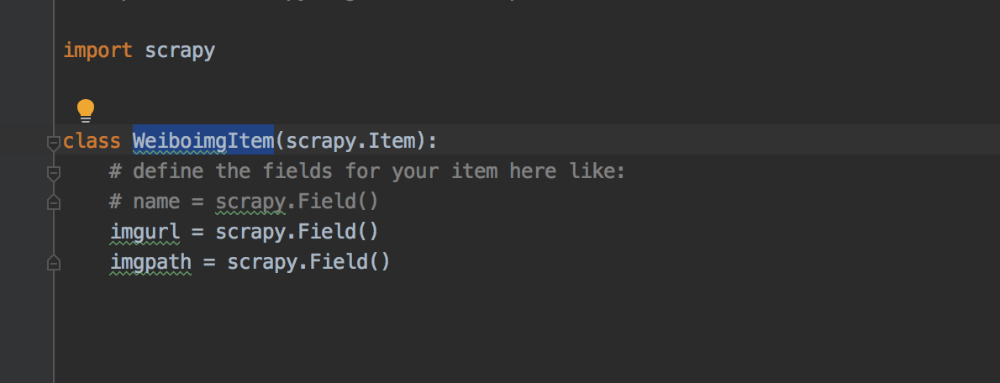

# weiboSpider

## 准备

+ python3以上
+ scrapy
  pip install scrapy(没装pip的百度安装)
+ selenium
  pip install -U selenium
+ chrome浏览器
 https://www.google.com/chrome/
 chrome driver
 http://npm.taobao.org/mirrors/chromedriver/

## settings.py

需要修改项：

`USER_AGENT = 'Mozilla/5.0 (Macintosh; Intel Mac OS X 10_13_6) AppleWebKit/537.36 (KHTML, like Gecko) Chrome/77.0.3865.90 Safari/537.36'`  
浏览器右键查看元素 -> 网络（刷新页面）-> 选择html文件 -> 请求头  
注：建议用chrome


`IMAGES_STORE = 'weiboImg/whYUEspecial'`  
保存路径

## items.py

文件保存相关的item。


只需要两项即可，一个图片的url，一个表示保存的path。
不用修改

## pipelines.py

文件保存管道
在setting中通过设置

```py
ITEM_PIPELINES = {
   'weiboImg.pipelines.WeiboimgPipeline': 300,
}
```

启用


重写两个方法分别对应item的两项，一个url，一个path。
不用修改。

## middlewares.py


加了selenium的webdriver模拟网页下拉，使用了chrome的无头浏览器

```py
driver = webdriver.Chrome(chrome_options=chrome_options, executable_path='/usr/local/bin/chromedriver')
```

executable_path="", 修改成自己的chromedriver地址  
time.sleep(3)  
每次下拉之后会sleep 3秒，等浏览器加载网页，如果网速比较慢的话，可适当增大。

## spiders

只使用了一个spider，在spiders目录下。
weibo.py

start_urls 开始的地址改成你要爬的地址，
可以放多个地址的列表  
注：微博用手机版即
m.weibo.com下的网址,如

复制地址栏的地址替换即可。

## 总结

要修改的：

+ setting.py  
  USER_AGENT
+ middlewares.py  
  excutable_path  
  time.sleep(3)
+ weibo.py  
  start_urls

使用方法：  

1. 在自己的某个目录下，git clone git@github.com:yky518/weiboSpider.git  
2. 修改上面列的几个文件  
3. 修改完后在主目录下，用scripy命令
   scripy crawl weibo